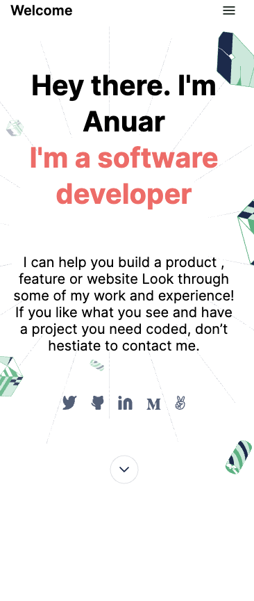

# Portfolio

> This is my responsive portfolio website.



## The objectives of this projects are:

- Understand how to parse a Figma design to create a UI.
- Flexbox to place elements in the page.
- Build a personal portfolio site.
- Use images and backgrounds to enhance the look of the website.
- Understand how to create UIs adaptable to different screen sizes using media queries.

## Built With

- HTML
- SCSS

## Live Demo

[Live Demo Link](https://anuarshaidenov.github.io/portfolio/)

## Installation

1. Clone the repository using

```
git clone https://github.com/anuarshaidenov/portfolio.git
```

2. cd into the cloned repository

```
cd portfolio
```

3. You now have the access to the files on your local machine!

### Optional step

Install the node_modules/ folder to be able to locally run the linter commands. Run:

```
npm install
```
To check Webhint linter errors run:

```
npx hint .
```
To check Stylelint linter errors run:

```
npx stylelint "**/*.scss"
```

## Author

- GitHub: [@anuarshaidenov](https://github.com/anuarshaidenov)
- Twitter: [@anuarnyi](https://twitter.com/anuarnyi)
- LinkedIn: [LinkedIn](https://www.linkedin.com/in/anuar-shaidenov-365a951b8/)

## 📝 License

This project is [MIT](./MIT.md) licensed.
